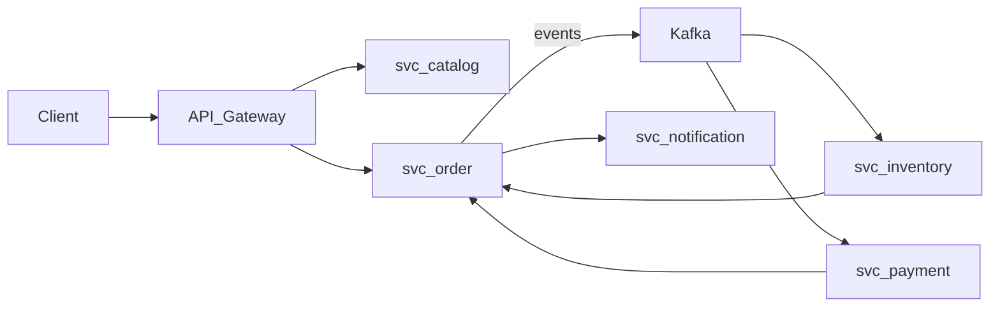

# Kickoff & Mapa de Contextos — visão de produto, domínios e Bounded Contexts; arquitetura alvo; plano editorial.

## Execute os seguintes comandos para iniciar o projeto:
```bash
mkdir saas-ecommerce && cd saas-ecommerce ## saas-ecommerce é o nome do projeto que estamos fazendo, pode colocar o nome do seu projeto pessoal
pnpm init -y
# package.json (raiz)
# { "private": true, "workspaces": ["apps/*", "libs/*"], "scripts": { "dev": "pnpm -r --parallel start:dev", "build": "pnpm -r build", "test": "pnpm -r test -- --coverage", "lint": "pnpm -r lint" } }

pnpm dlx @nestjs/cli new apps/svc-catalog --package-manager=pnpm --strict
pnpm dlx @nestjs/cli new apps/svc-inventory --package-manager=pnpm --strict
pnpm dlx @nestjs/cli new apps/svc-order --package-manager=pnpm --strict

pnpm i --lockfile-only
```



```bash

```